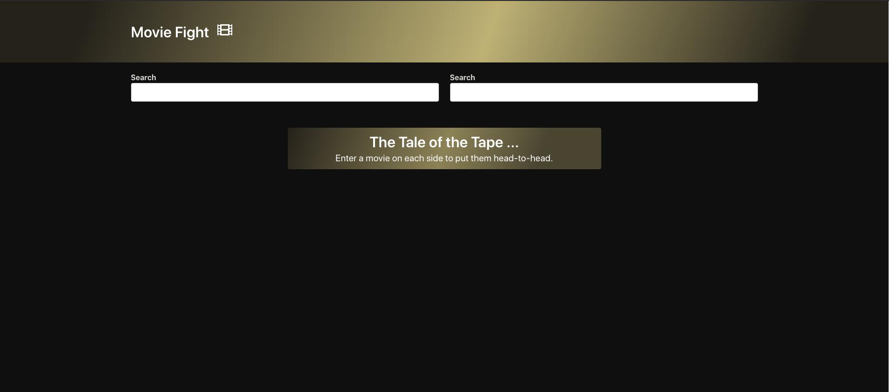
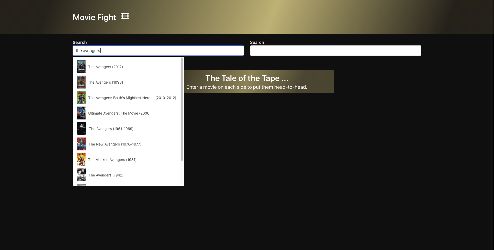
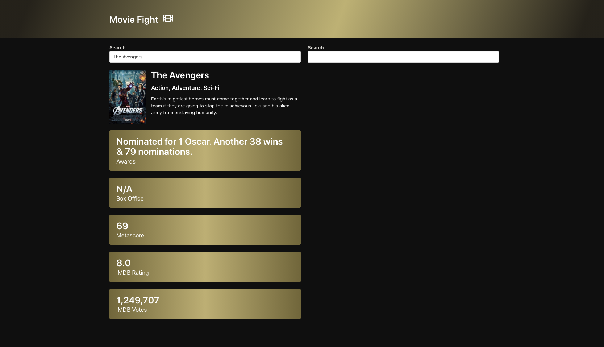
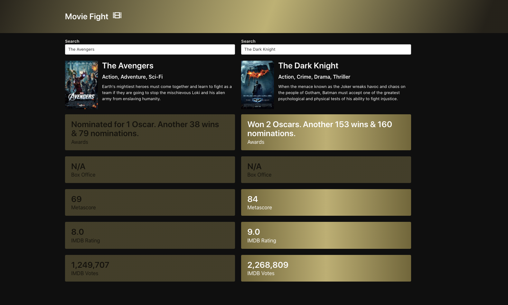

# Movie-Fight

## Overview
Movie-App is a client-side application that allows the user to "battle-out" two movies based on five attributes: (1) the number of award wins and nominations, (2) the box office numbers, (3) Metascore, (4) IMDB rating, and (5) the number of IMDB votes.  

The movies are each inputted into separate search boxes, one on the left side of the screen, and the other on the right side of the screen. 




An auto-suggestion list will be provided as movie is inputted into the search box. 



When the user selects a movie from this list, the results will then be displayed below the search input. 



Once the second movie is searched and the results are displayed below its search box, the attribute with higher stat will remain highlighted for the corresponding movie.




## Installation
```
git clone https://github.com/onTheDL/Movie-Fight.git
cd Movie-Fight
open index.html
```

